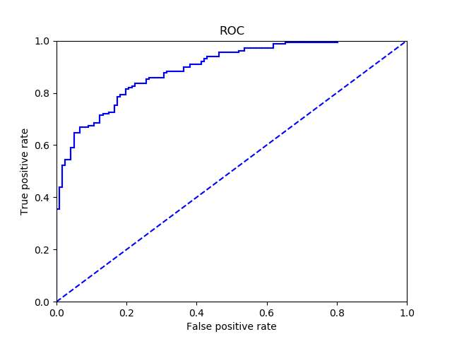

# Estimate Your Model

[](https://lgtm.com/projects/g/peteryuX/retinaface-tf2/context:python)


:fire: I think estimating your model is a very important step to elevate your project preformance. :fire:

>For example, if our project is a object detection task.
>
>We can estimate our model by mAP, recall and precision.
>
>And the outputs of object detection model are scores, location and classification.
>
>We need to use scores to judge positive or negative objects.
>
>Use small score to be the threshold can rise recall.
>
>But, the precision maybe go down because the precision is related to IOU.
>
>So, you can use grid search to decide which score is the best threshold.
>
>And I used to set IOU be 0.5.
>
>:pizza:Use mAP to estimate your object detection model and enjoy it!
>
>****

****

## Contents
:bookmark_tabs:

1. [Recall]()
2. [Precision]()
3. [mAP]()
4. [AUC]()
5. [ROC]()

***

### Recall

You can use recall to estimate your binary model like image classification and you can also use it to estimate your object detection task.

In binary model:

```mathematica
recall = TP / (TP +FN)
```

In object detection:

```mathematica
recall = TP / gtp
```

gtp is ground truth positive.

### Precision

```mathematica
precision = TP / (TP + FP)
```

### mAP(mAP50, mAP75, mAP)

mAP - mean accuracy precision.

mAP is a very important metric in object detection.

:fire:what is the meaning of difficult in VOC labels?

**The object has been labeled by difficult does not join in evaluation.** 

```python
1.Get positive objects that score > 0.3
2.sort the positive objects in a descending order  # we need to make a json file that named by class_name such as class_name_dr.json. And the json has information like [score, file_id, bounding_box]. Then sort it by score. 
# Also, we need to make gt files named by file_id_gt.json.
# And the file has information [score, class_name, used, bounding_box].
3.caculate ap for every class
4.TP = [0] * num_positive
5.FP = [0] * num_positive
6.for idx, obj in positives:
    if max_iou > iou_threshold:
        TP[idx] = 1
    elif max_iou < iou_threshold:
        FP[idx] = 0
7.caculate AP for each class
8.Firstly, you need to make the precision monotonically decreasing
######################################################################
# matlab indexes start in 1 but python in 0, so I have to do:
#     range(start=(len(mpre) - 2), end=0, step=-1)
# also the python function range excludes the end, resulting in:
#     range(start=(len(mpre) - 2), end=-1, step=-1)
for i in range(len(mpre)-2, -1, -1):
	mpre[i] = max(mpre[i], mpre[i+1])
######################################################################
9.Secondly, get the area under precision curve
```

### AUC（Area Under ROC Curve）

AUC is the area under ROC curve, the higher the ROC is and the better the model is.

### ROC

The x is False Positive Rate, the y is True Positive Rate.



### Log Average Miss Rate

lamr is as small as possible.

lamr = exp(sum(log(mr)) / 9)

Calculated by averaging miss rates at 9 evenly spaced FPPI points between 10e-2 and 10e0, in log-space.s

### ToDO

* [x] lamr(log average miss rate)


